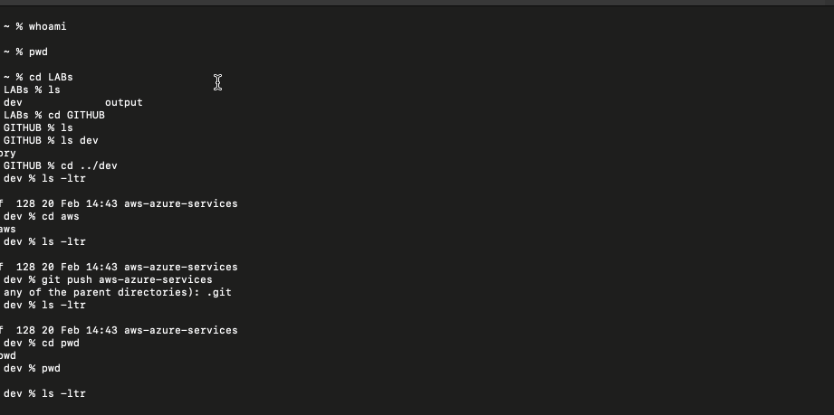

### Setup an environment
```sh
alias k=kubectl
export do="--dry-run=client -o yaml"
```
##### Enable kubectl autocompletion 
```sh
echo 'source <(kubectl completion bash)' >>~/.bashrc
kubectl completion bash >/etc/bash_completion.d/kubectl
```
##### Extend shell completion to work with an alias, in this case 'k'

```sh
echo 'alias k=kubectl' >>~/.bashrc
echo 'complete -F __start_kubectl k' >>~/.bashrc
```
# Reload your shell


